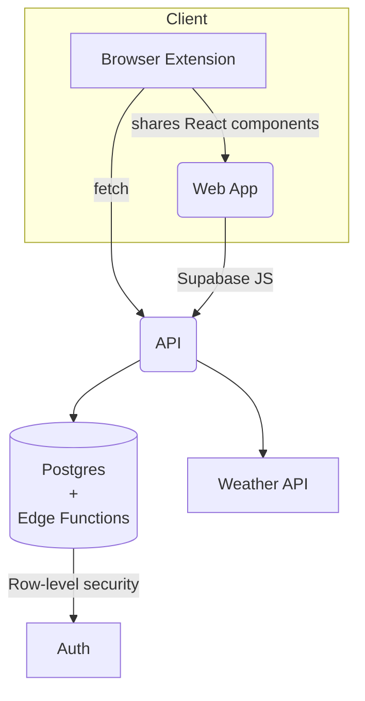

# 🚀 AttributeAI


> **Unlimited Keyword & Attribution Intelligence, right inside your browser**
> AttributeAI unifies a real‑time multi‑touch attribution engine (with weather correlation) and an AI‑driven SEO/Content toolkit delivered via a Chrome extension and web app.

---

## ✨ Modules at a Glance

| Module                 | What it does                                                                                                                                   |
| ---------------------- | ---------------------------------------------------------------------------------------------------------------------------------------------- |
| **Browser Extension**  | One‑click overlay on Google & YouTube SERPs that extracts live keyword metrics, competitor data, and pushes them to the Content Strategist.    |
| **Content Strategist** | Web app that turns a seed keyword or URL into a 2 000‑word, fully‑linked content brief with competitive gap analysis.                          |
| **Attribution Engine** | Five attribution models (First, Last, Linear, Time‑Decay, Position) with weather‑impact overlays and real‑time customer‑journey visualisation. |
| **API Layer**          | REST & Supabase Edge Functions feeding the extension, strategist, and analytics dashboards.                                                    |
| **Roadmap**            | Analytics dashboard, team workspaces, Google Search Console auto‑imports.                                                                      |

---

## 🌟 Overview

AttributeAI is the world's first **multi‑touch attribution platform with weather intelligence correlation**. It combines advanced attribution modelling with AI‑powered SEO analysis, content generation, and real‑time customer‑journey tracking.

---

## 🖼️ Architecture



---

## 🎯 **Advanced Attribution Engine**

* **5 Attribution Models**: First Click, Last Click, Linear, Time‑Decay, Position‑Based
* **Real‑time Model Comparison**: Switch between models instantly
* **Weather Intelligence**: Correlate attribution with weather conditions
* **Customer Journey Visualisation**: Complete touch‑point tracking

## ⚡ **Real‑Time Journey Tracking**

* **Live Session Monitoring**: Track customers across multiple visits
* **Real‑Time Touch‑point Capture**: Instant attribution updates
* **Cross‑Device Tracking**: Unified customer identification
* **Weather Correlation**: Real‑time weather data integration

## 🤖 **AI SEO Strategist**

* **Competitive Intelligence**: Automated analysis of top 5 organic competitors
* **On‑Page Gap Analysis**: Technical SEO and content opportunity identification
* **Real Website Analysis**: Live analysis using Claude API / OpenAI
* **Actionable Roadmaps**: Quick wins and strategic plays with impact scoring

## 📝 **AI Content Generator**

* **2 000+ Word Blog Posts**: SEO‑optimised content generation
* **Multi‑Format Export**: HTML, Markdown, Text, JSON
* **Strategic Linking**: Internal and external link optimisation
* **Research‑Backed**: Authoritative external citations
* **Local SEO**: Location‑specific optimisation

## 📊 **Journey Analytics**

* **Conversion Path Analysis**: Top‑performing customer journeys
* **Real‑Time Trends**: Hourly session and conversion tracking
* **Weather Impact Analysis**: Performance correlation with weather
* **Device Performance**: Cross‑device journey insights

---

## 🛠️ Tech Stack

* **Frontend**: React 18, Tailwind CSS, Lucide React
* **Extension Build**: Vite, Manifest V3
* **Backend**: Node.js, Express, Supabase Edge Functions
* **AI Integration**: Claude API, OpenAI API, Google AI
* **Charts**: Recharts
* **Session Management**: Custom SessionManager utility
* **CI/CD**: GitHub Actions → Netlify / Chrome Web Store

---

## 🚀 Quick Start

### Prerequisites

* Node.js 18+ and **pnpm** (Corepack‑enabled)
* API keys for AI services (Claude, OpenAI, Google AI)

### Installation

```bash
# Clone & enter repo
pnpm dlx degit Christo-Brits/AttributeAI
cd AttributeAI

# Install dependencies
corepack enable
pnpm install --frozen-lockfile

# Copy env template
cp .env.example .env  # then add your keys

# Start dev servers
# Terminal 1 – API
pnpm --filter server dev
# Terminal 2 – Web + Extension preview
pnpm --filter web-app dev
```

### Open your browser

Navigate to `http://localhost:3000`.

---

## 🔧 Configuration

Create a `.env` file in the repo root and add keys like so:

```env
# AI Services
ANTHROPIC_API_KEY=your_claude_api_key
OPENAI_API_KEY=your_openai_api_key
GOOGLE_AI_API_KEY=your_google_ai_key

# Feature Flags
ENABLE_SEO_ANALYSIS=true
ENABLE_CONTENT_GENERATION=true
ENABLE_WEATHER_CORRELATION=true
DEBUG_MODE=false
```

---

## 📁 Project Structure

```
AttributeAI/
├── packages/
│   ├── extension/            # Chrome extension (Manifest V3)
│   └── web-app/              # React front‑end
├── server/                   # Node.js / Supabase Edge functions
├── scripts/                  # Release & tooling
├── .github/workflows/ci.yml  # CI pipeline
└── README.md
```

---

## 🚀 Next Features (Roadmap)

* [ ] Google Analytics integration
* [ ] Advanced Weather API connection
* [ ] Machine‑learning predictions
* [ ] Cross‑device fingerprinting
* [ ] Real‑time bid optimisation
* [ ] Custom attribution models
* [ ] Database storage & history
* [ ] User authentication / team collaboration

---

## 🤝 Contributing

1. Fork the repository.
2. Create your feature branch: `git checkout -b feat/awesome`.
3. Commit your changes: `git commit -m "feat: add awesome"`.
4. Push to the branch: `git push origin feat/awesome`.
5. Open a Pull Request.

---

## 📄 License

MIT – see the [LICENSE](LICENSE) file for details.

---

**🌟 AttributeAI – The future of real‑time attribution & AI‑driven SEO. ⚡🌦️**
